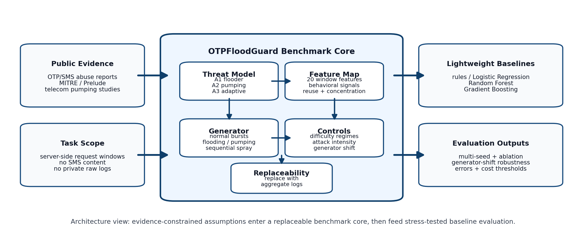
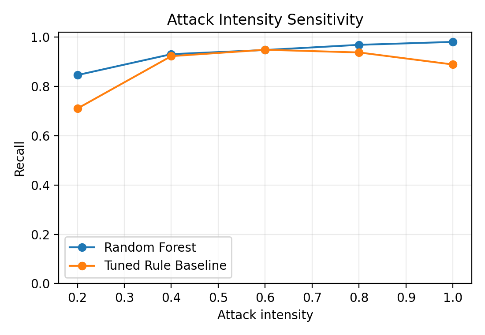
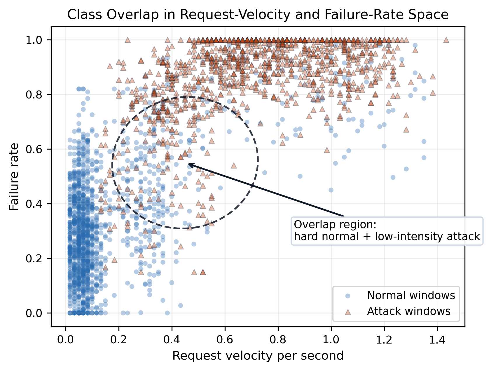
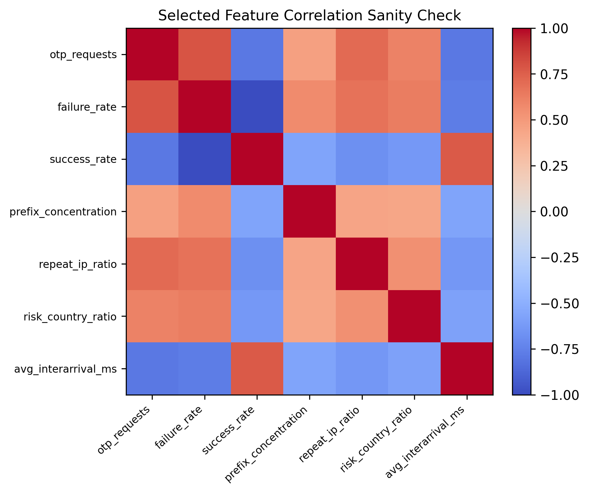

# OTPFloodGuard: A Public-Evidence-Constrained Benchmark for Lightweight OTP Flooding Detection

Wenche An  
Kamran Aziz  
Computer Science; Digital Technologies  
Hainan Bielefeld University of Applied Sciences, China  
wenche.an.24@stu.hainan-biuh.edu.cn; kamran.aziz@hibiuh.edu.cn

## Abstract

One-time password (OTP) services can be abused through OTP flooding and SMS pumping, but public incident-labeled OTP request-window datasets remain limited because such logs may contain sensitive authentication metadata. This paper presents OTPFloodGuard, a public-evidence-constrained simulated benchmark for lightweight OTP flooding detection. Its construction procedure maps public OTP/SMS abuse evidence to explicit threat assumptions, window-level features, difficulty controls, and evaluation diagnostics. As a baseline use case, Random Forest achieves an F1-score of 0.9617 on the main Overlap benchmark, a mean F1-score of 0.9514 +/- 0.0052 across seven stratified train-test splits, and a mean F1-score of 0.9496 +/- 0.0057 across five separately regenerated benchmark instances. Performance decreases from 0.9876 F1 on Easy to 0.8967 F1 on Adaptive, and generator-shift testing reduces Random Forest F1 to 0.8806. These results support OTPFloodGuard as a stress-testing benchmark for SOC early-warning research, not as a proxy for production accuracy.

Keywords: OTP flooding, SMS pumping, public-evidence-constrained benchmark, simulated security data, lightweight machine learning

## I. Introduction

OTP verification is a common authentication mechanism in digital platforms. It helps verify that a user controls a phone number or communication channel during signup, login, password reset, or transaction confirmation. However, OTP workflows can themselves become abuse targets. OTP flooding and SMS pumping have been documented in public fraud-prevention guidance, threat-intelligence sources, and telecom-security research [1]--[7]. In these attacks, an adversary repeatedly triggers OTP messages through automated signups, abused verification endpoints, or scripted request flows. Such activity may increase messaging costs, exhaust verification capacity, deny service to legitimate users, or support broader identity-abuse and authentication-availability campaigns [1], [3]--[7].

Public industry reports and security knowledge bases describe SMS pumping as a practical abuse pattern [1]--[6]. Academic work on telecom traffic pumping also shows that fraud detection often depends on engineered behavioral variables and expert validation rather than content inspection alone [7]. These sources mention abnormal request bursts, low verification completion, destination or carrier concentration, repeated source behavior, residential proxies, and automated triggering of account-verification fields. These observations motivate a server-side request-window detection task: instead of inspecting SMS content or private user messages, a defender monitors aggregate behavior over short time windows and decides whether a window deserves alerting, risk scoring, or rate limiting.

The main challenge is data availability. Public incident-labeled OTP request-window datasets remain limited because such logs may reveal sensitive authentication metadata, phone-number patterns, IP/device information, carrier routing, and security incident labels. It would be misleading to replace this task with unrelated public datasets. Network intrusion datasets capture packet or flow behavior, not OTP verification workflows [8]. SMS spam datasets classify message content, not request flooding [9]. Credit card fraud datasets model payment transactions rather than authentication requests [10]. These datasets may be real, but they do not represent OTP request-window behavior.

Because task-matched public OTP flooding benchmarks remain limited, researchers face a choice between using mismatched public datasets or building synthetic benchmarks. This paper takes the second path, but makes the simulation assumptions explicit, evidence-constrained, and experimentally stress-tested.

OTPFloodGuard turns the absence of public OTP flooding logs into an explicit benchmark-design problem: how to construct, stress-test, and report OTP abuse simulations responsibly.

The paper addresses four research questions:

RQ1: Can lightweight models outperform simple rule-based baselines under public-evidence-constrained simulated OTP flooding scenarios?

RQ2: How does detection performance change across Easy, Overlap, and Adaptive benchmark settings?

RQ3: Which feature groups contribute most to detection performance, and what patterns characterize model errors?

RQ4: How do attack intensity and threshold selection affect early-warning and conservative-response use cases?

The contributions are:

1. A public-evidence-constrained benchmark construction method that maps OTP/SMS abuse evidence into explicit threat assumptions, feature definitions, and replaceable simulation controls.
2. A multi-difficulty OTP flooding benchmark with Easy, Overlap, and Adaptive regimes, designed to avoid evaluating only trivially separable synthetic attacks.
3. A stress-tested lightweight baseline evaluation that combines multi-split stability, generator-seed sensitivity, generator-shift robustness, feature-group ablation, threshold sensitivity, and error-case inspection to evaluate benchmark behavior beyond single-score reporting.

## II. Background and Related Work

OTP flooding and SMS pumping are related to authentication abuse and telecom fraud. Adversaries repeatedly request OTP messages, route traffic toward costly destinations, or overload verification services. Public industry reports and threat knowledge bases provide operational descriptions of OTP and SMS abuse, including request velocity, verification failure, destination concentration, carrier/country anomalies, and repeated source behavior [1]--[6].

Rule-based controls and rate limiting are common first defenses. They are attractive because they are simple, fast, and easy to audit. For example, a system may block or challenge traffic when request count and failure rate exceed fixed thresholds. However, simple rules can fail when legitimate events resemble attacks or when attackers lower their rate, distribute infrastructure, or avoid obvious failure patterns. This motivates comparing machine learning against tuned rules rather than reporting model scores alone.

Peer-reviewed telecom-fraud research supports the use of engineered behavioral indicators for suspicious traffic analysis [7]. Lightweight machine learning is useful for tabular security logs because models such as Logistic Regression, Random Forest, and Gradient Boosting can combine weak signals without requiring heavy deep learning infrastructure [11]--[13]. These models are appropriate baselines for the benchmark setting. Random Forest provides impurity-based feature importance, while permutation importance offers a separate diagnostic of model reliance [14]. Neither measure provides causal explanation, but together they help distinguish a training-only ranking heuristic from a validation-based interpretability diagnostic.

Methodological work on security datasets and machine-learning evaluation motivates the emphasis on explicit assumptions and cautious interpretation. Sommer and Paxson warn that intrusion-detection results can fail outside closed-world experimental settings [18]. Broader work on dataset development also emphasizes that dataset choices, labels, and collection conditions shape what conclusions can be drawn [19]. Work on tabular-data modeling further shows that dataset structure, feature characteristics, and task alignment strongly affect evaluation conclusions [20].

The main gap is not the lack of classifiers. Publicly available, task-matched OTP flooding benchmarks remain limited. This paper focuses on benchmark design: how to turn public evidence into explicit simulation assumptions, how to stress-test the assumptions with difficulty levels and attack intensity, and how to report limitations without claiming real-world deployment validity.

Unlike generic intrusion, SMS spam, or transaction-fraud datasets, OTPFloodGuard focuses on server-side OTP request-window behavior and reports its assumptions, difficulty controls, and failure cases directly.

## III. Threat Model and Scope

This paper studies server-side OTP request-window behavior under simulated flooding, pumping, and sequential spray patterns. The defender observes aggregate metadata such as request counts, success/failure rates, repeated IP/device behavior, destination distribution, and timing. The defender does not inspect SMS content or use raw phone numbers.

The benchmark models three attacker profiles: A1 Naive Flooder, with high request velocity, high failure rate, and repeated IP/device behavior; A2 Pumping-Oriented Attacker, with concentration on prefixes, countries, carriers, or costly destinations; and A3 Adaptive Low-Rate Attacker, with lower velocity, distributed identifiers, higher apparent success, and normal-looking behavior.

The paper does not address SIM swap, local malware that steals OTP messages, user-side phishing, man-in-the-middle attacks, SMS content analysis, real carrier billing-cost modeling, or production automatic blocking policies. Prior work shows that SMS OTPs also face important local-device threats [15], but those threats are outside the scope of this request-window benchmark.

## IV. Public Evidence and Benchmark Design Assumptions

Table I summarizes both evidence-supported risk signals and explicit benchmark design assumptions. The cited sources motivate the modeled abuse indicators, while the final two rows define controlled stress conditions for harder normal and adaptive attack cases. These choices make the benchmark assumptions visible and replaceable, but they do not establish production distributions or real-world model validity.

| Evidence or benchmark assumption | Threat assumption | Simulated behavior and features |
| --- | --- | --- |
| Twilio and RingCaptcha describe abnormal OTP/SMS request bursts and resource exhaustion [1], [4] | Automation increases short-window activity | Increase request count and velocity; otp_requests, request_velocity_per_sec, avg_interarrival_ms |
| Twilio Verify guidance discusses OTP abuse signals and fraud controls [2] | Abuse traffic often has lower verification completion | Increase failure rate and reduce success rate; failure_rate, success_rate |
| IPQualityScore, MITRE, and Prelude describe toll-fraud, SMS pumping, and destination or routing concentration [3], [5], [6] | Pumping may concentrate prefixes, carriers, countries, or destinations | Increase prefix concentration or alter country/carrier distribution; prefix_concentration, country_entropy, carrier_entropy, risk_country_ratio |
| Public fraud guidance identifies behavioral abuse signals [1]--[6], while peer-reviewed telecom traffic-pumping research supports engineered and explainable indicators [7] | Source behavior may reveal simple or adaptive automation | Vary IP/device reuse and ratios; unique_ip_count, unique_device_count, repeat_ip_ratio, ip_phone_ratio, device_phone_ratio |
| Benchmark stress assumption: legitimate bursts and delivery-failure-like behavior may resemble abuse signals | Some normal windows are intentionally made difficult | Inject hard normal windows with high volume or failure-like behavior; otp_requests, failure_rate, prefix_concentration |
| Adaptive stress assumption: attack features are shifted toward normal distributions to test threshold evasion | Low-rate attacks are designed to resemble normal traffic | Move attack windows toward normal feature distributions across the modeled behavioral features |

## V. Benchmark Design

### A. Pipeline

Fig. 1 presents the OTPFloodGuard benchmark architecture.

The architecture makes the generator assumptions, feature definitions, and evaluation stages explicit. Each result should be traceable back to a threat assumption and a feature definition.

### B. Window Definition and Behavior Classes

Each sample is a short OTP monitoring window. The primary setting uses 60-second windows. The class label is binary: normal or attack. Attack windows include OTP flooding, SMS pumping, and sequential phone-number spray. Normal windows include ordinary traffic and harder normal cases such as legitimate registration bursts or delivery-failure-like windows.

The 60-second window is a benchmark design choice rather than a production-validated aggregation interval. Evaluating alternative window lengths requires event-level request sequences and is left for future validation.

### C. Feature Groups

The benchmark implements 20 window-level numeric features grouped into five roles: window/volume, destination behavior, source/device behavior, verification outcome, and context/routing. Exact definitions and summary statistics are exported in `feature_dictionary.csv`. Some features are correlated by design; for example, success_rate and failure_rate are complements. The evaluation therefore uses feature-group ablation and permutation importance rather than treating impurity-based feature importance as a causal explanation.

### D. Difficulty Levels

Table II summarizes the qualitative design of the Easy, Overlap, and Adaptive regimes, while Table III reports their implementation-level controls. These controls define benchmark settings rather than estimates of production traffic.

| Setting | Purpose | Design |
| --- | --- | --- |
| Easy | Sanity check | Attacks have clearer high velocity, high failure rate, reuse, or destination concentration |
| Overlap | Main benchmark | Legitimate bursts, delivery failures, and low-intensity attacks create overlap between normal and attack windows |
| Adaptive | Stress test | Attack windows are blended toward normal-window distributions by reducing velocity, distributing IP/device identifiers, and imitating normal success behavior |

| Feature group | Easy | Overlap | Adaptive |
| --- | --- | --- | --- |
| Request velocity | Attack request counts multiplied by 1.35 | Base benchmark with injected legitimate bursts and low-intensity attacks | Attack count and velocity features blended as 0.22 attack signal + 0.78 sampled normal signal |
| Verification outcome | Attack success rates multiplied by 0.55, making failures more visible | Base benchmark includes both clear failures and delivery-failure-like normal windows | Success/failure behavior blended toward sampled normal windows |
| Destination concentration | Attack prefix concentration multiplied by 1.18; normal prefix concentration multiplied by 0.85 | Pumping and legitimate concentration patterns coexist | Prefix, country, carrier, and risk features blended toward normal windows |
| IP/device reuse | Attack repeat-IP ratio multiplied by 1.12 | Reuse signals vary across flooding, pumping, sequential spray, and normal bursts | IP/device count and reuse features blended toward normal windows |
| Context and timing | Mostly unchanged except for derived feature recalculation | Base contextual and timing distributions | Contextual and timing features blended toward normal windows |

The Adaptive blending factor defines a difficulty setting, while the attack-intensity experiment in Section VI varies a separate stress-test parameter, alpha. Future benchmark versions should replace these controls with aggregate statistics from real OTP services when such data can be obtained under privacy constraints.

### E. Generation and Reproducibility

The primary Overlap benchmark is generated with generator seed 42. The primary Overlap dataset contains 12,000 windows: 6,986 normal windows and 5,014 attack windows. Attack windows include 2,187 flooding, 1,882 SMS pumping, and 945 sequential spray windows. Easy and Adaptive use the same sample count and class distribution as Overlap; only simulation controls change. The generator samples a behavior class, creates count and behavioral features, injects legitimate-burst and low-intensity cases, recalculates derived ratios, and exports data, metrics, plots, and error-analysis files.

The code and generated artifacts are available in a public repository.\footnote{\url{https://github.com/Anwenche/otpfloodguard-benchmark}} The repository contains the simulation script, generated CSV results, paper figures, and commands for quick verification and full reproduction. All included data are simulated; no real OTP logs or private user records are used.

### F. OTPFloodGuard Benchmark Card

Table IV summarizes the intended use and boundaries of OTPFloodGuard.

| Item | Description |
| --- | --- |
| Intended use | Research benchmarking, controlled model comparison, and SOC early-warning studies |
| Not intended use | Production blocking, real-world accuracy claim, carrier billing estimation, or replacement for incident-labeled logs |
| Unit of analysis | Short server-side OTP request window |
| Label source | Simulation generator with explicit behavior classes |
| Evidence source | Public OTP abuse, SMS pumping, telecom fraud, and security-evaluation literature |
| Difficulty regimes | Easy, Overlap, and Adaptive |
| Main risks | Synthetic labels, subjective parameters, incomplete attacker behavior, and missing real deployment feedback |
| Replaceable parts | Feature distributions, difficulty controls, attack ratios, country/carrier assumptions, and threshold policies |
| Future calibration | Anonymized aggregate OTP request statistics and labeled private incident windows |

### G. Assumption Replaceability

Table V shows how major benchmark assumptions can be replaced when better evidence becomes available.

| Assumption | Current simulation control | Future replacement evidence |
| --- | --- | --- |
| Attack windows have higher request velocity | Request-count multipliers and inter-arrival shifts | Aggregate per-minute OTP request distributions from a real service |
| Abuse often has lower verification completion | Success/failure-rate shifts | Verification-completion and timeout statistics by window |
| Pumping may concentrate destinations | Prefix, country, carrier, and risk-ratio controls | Anonymized prefix/carrier/country aggregate distributions |
| Automation may reuse infrastructure | IP/device count and repeat-ratio controls | Aggregate unique-IP and unique-device counts per window |
| Adaptive attacks can resemble normal traffic | Feature-space blending toward sampled normal windows | Incident-derived attacker behavior or analyst-labeled adaptive cases |
| Low-intensity attacks are harder | Attack-intensity alpha in the feature-space transformation | Real incident severity levels or aggregate attack-volume bands |

## VI. Experimental Setup

The evaluated methods are Logistic Regression, Random Forest, Gradient Boosting, a tuned four-signal rule baseline, and a velocity-and-failure rule baseline. The tuned four-signal rule raises an alert when either request count and failure rate exceed their thresholds, or prefix concentration and repeated-IP ratio exceed their thresholds. Its thresholds are selected by maximizing mean validation F1 across five stratified folds within the training portion. The velocity-and-failure rule represents a simple early OTP protection strategy based only on request volume and verification failure, and its thresholds are selected with the same training-only objective.

The primary experiments use a stratified 80/20 train-test split, with the same split applied to all learned and rule-based baselines. Model fitting, feature ranking, feature scaling, and rule-threshold selection use only the training portion. The held-out test set is reserved exclusively for final reporting after all model, feature, and threshold choices have been fixed. The main reported results use generator seed 42 and train-test split seed 42, while the seven-split analysis evaluates sensitivity to the data split.

Model configurations are fixed before test evaluation. Random Forest uses 250 trees, a maximum depth of 10, a minimum of three samples per leaf, and no class weighting. Logistic Regression uses L2 regularization, a training-fitted StandardScaler pipeline, and a maximum of 1,000 iterations. Gradient Boosting uses 100 estimators, a learning rate of 0.1, a maximum tree depth of 3, full subsampling, and log-loss optimization. Full estimator parameters, rule grids, and software versions are exported in `model_config.json`, `rule_config.json`, and `environment.json`.

The Top-15, Top-10, and Top-5 feature subsets are defined using Random Forest impurity-based importance computed from the training portion. This is used as a training-only ranking heuristic and may favor features with more split opportunities. Separately, cross-validated permutation importance is used only as an interpretability diagnostic and is not used to select the reported feature subsets. The ranking metadata is exported in `feature_ranking_metadata.json`.

Random Forest is designated as the primary diagnostic model in the revised reproduction protocol because it provides a lightweight nonlinear baseline and supports the planned feature, threshold, and error analyses. This designation is not based on held-out test performance. The estimator configurations are fixed as lightweight baseline settings before held-out test evaluation and are not optimized against the held-out test set.

The experiments are implemented in Python with scikit-learn [16]. The main metrics are precision, recall, F1-score, ROC-AUC, and PR-AUC. PR-AUC is included because precision-recall analysis is often more informative than ROC alone when the positive class and false alerts matter operationally [17]. Split-sensitivity evaluation uses seven stratified train-test split seeds: 3, 7, 13, 21, 42, 99, and 123. The underlying generated benchmark is held fixed; only the train-test partition changes. Generator-seed sensitivity is evaluated by regenerating the Overlap benchmark with five fixed generator seeds while holding the train-test split seed, model configurations, and evaluation protocol constant. Additional experiments include difficulty progression, attack-intensity sensitivity, feature-group ablation, threshold modes, permutation importance, generator-shift robustness, and error analysis.

Cost-sensitive decision thresholds are selected using out-of-fold predictions from five-fold stratified cross-validation on the training portion only. For each false-negative/false-positive cost ratio, the threshold minimizing the corresponding weighted error is fixed before evaluation on the held-out test set. The test set is not used for threshold selection, and the OOF diagnostics are exported in `threshold_selection_oof.csv`.

Model scores are used as empirical decision scores for threshold selection and are not interpreted as calibrated attack probabilities.

A shifted held-out evaluation is performed on held-out test rows transformed by a separately seeded, class-conditional, label-preserving feature generator. Ground-truth class labels are used only to construct the class-conditional, label-preserving synthetic shift and are not provided to the detector. The shifted generator increases benign burst ambiguity, reduces obvious attack intensity, distributes attack infrastructure, and changes timing/noise assumptions. Model parameters, selected features, model-score thresholds, fitted scalers, and rule thresholds are fixed before evaluation; no retuning or refitting is performed on the shifted evaluation data. The shifted-set construction metadata is exported in `generator_shift_metadata.json`.

Attack intensity is implemented as a scaling factor applied to attack windows relative to sampled normal windows:

`x'_{i,f} = [n_{i,f} + alpha(x_{i,f} - n_{i,f})]epsilon_{i,f}`

where \(x_{i,f}\) is the original attack value for sample \(i\) and feature \(f\), \(n_{i,f}\) is a sampled normal reference, \(\alpha \in \{0.2,0.4,0.6,0.8,1.0\}\), and \(\epsilon_{i,f}\) is per-sample, per-feature multiplicative noise drawn from \(\mathcal{N}(1,0.04^2)\). Ratio-valued features are clipped to predefined valid ranges. Count-valued features are rounded to the nearest integer and clipped to feature-specific lower bounds.

## VII. Results

### A. Main Model Comparison

Table VI reports the Overlap simulated benchmark results.

| Model | Feature set | Precision | Recall | F1 | ROC-AUC | PR-AUC |
| --- | --- | ---: | ---: | ---: | ---: | ---: |
| Random Forest | Full | 0.9469 | 0.9771 | 0.9617 | 0.9942 | 0.9913 |
| Gradient Boosting | Full | 0.9545 | 0.9611 | 0.9578 | 0.9942 | 0.9917 |
| Logistic Regression | Full | 0.9100 | 0.9272 | 0.9185 | 0.9820 | 0.9751 |
| Velocity + Failure Rule | Rules | 0.9190 | 0.8824 | 0.9003 | N/A | N/A |
| Tuned Rule Baseline | Rules | 0.9073 | 0.8883 | 0.8977 | N/A | N/A |

For RQ1, Random Forest and Gradient Boosting achieve higher reported F1 and recall than the rule baselines under the Overlap simulated benchmark settings. The result does not show deployment readiness; it shows that combining multiple window-level signals can improve over simple threshold rules under the simulated assumptions.

The benchmark contains 12,000 windows, including 5,014 attack windows and 6,986 normal windows. This 41.8% attack proportion is a controlled benchmark base rate chosen to support model comparison and error analysis, not an estimate of production OTP abuse prevalence. The generated dataset size and class balance are exported in `benchmark_config.json`.

Table VII summarizes performance across seven stratified train-test partitions of the same generated Overlap dataset. These results measure sensitivity to data partitioning rather than sensitivity to generator randomness.

| Model | F1 mean +/- std | Recall mean +/- std |
| --- | ---: | ---: |
| Random Forest | 0.9514 +/- 0.0052 | 0.9748 +/- 0.0059 |
| Gradient Boosting | 0.9463 +/- 0.0067 | 0.9570 +/- 0.0064 |
| Logistic Regression | 0.9053 +/- 0.0073 | 0.9217 +/- 0.0033 |
| Tuned Rule Baseline | 0.8914 +/- 0.0040 | 0.8888 +/- 0.0041 |
| Velocity + Failure Rule | 0.8917 +/- 0.0051 | 0.8808 +/- 0.0042 |

The multi-split stability results show that the two tree-based models remain stronger than the rule baselines across splits, while the rule baselines remain useful as simple interpretable reference points. The multi-split mean and standard deviation describe sensitivity to the train-test partition of one fixed generated dataset. They should not be interpreted as confidence intervals from independent dataset replications.

Generator-seed sensitivity measures variation across separately regenerated synthetic benchmark instances. Across five separately regenerated Overlap benchmarks, Random Forest obtains an F1-score of 0.9496 +/- 0.0057 and Gradient Boosting 0.9469 +/- 0.0054. Both rule baselines remain close to 0.89 F1. These results reduce dependence on one synthetic draw but do not establish real-world distributional validity. Full model-wise results are provided in the repository and exported in `generator_seed_metrics.csv`, `generator_seed_summary.csv`, and `generator_seed_config.json`.

### B. Difficulty Progression

Table VIII compares Random Forest with the tuned four-signal rule across the Easy, Overlap, and Adaptive regimes.

| Difficulty | Random Forest F1 | Random Forest recall | Tuned-rule F1 | Tuned-rule recall |
| --- | ---: | ---: | ---: | ---: |
| Easy | 0.9876 | 0.9920 | 0.9447 | 0.9621 |
| Overlap | 0.9617 | 0.9771 | 0.8977 | 0.8883 |
| Adaptive | 0.8967 | 0.8824 | 0.7236 | 0.7438 |

For RQ2, performance decreases as the benchmark becomes harder. This difficulty progression is a sanity check: Adaptive attacks are harder because they move toward normal behavior rather than simply increasing request volume. The difficulty levels are not intended to represent measured real-world prevalence. They are controlled stress-test regimes, so absolute scores should be compared within the benchmark rather than interpreted as production estimates.

### C. Generator-Shift Robustness

The shifted held-out evaluation tests model sensitivity to assumptions encoded by the original synthetic generator. Models are trained on the original Overlap training portion and evaluated on label-preserving shifted versions of the held-out test rows. No model, scaler, selected feature set, model-score threshold, or rule threshold is refitted or retuned on the shifted evaluation data.

Table IX summarizes the four controls modified in the shifted evaluation.

| Shifted component | Change |
| --- | --- |
| Benign bursts | More high-volume and lower-completion normal windows |
| Attack intensity | Reduced request-volume and failure-rate separation |
| Infrastructure behavior | More distributed IP/device reuse patterns |
| Timing and noise | Altered inter-arrival timing and multiplicative feature noise |

| Model | Precision | Recall | F1 | ROC-AUC | PR-AUC |
| --- | ---: | ---: | ---: | ---: | ---: |
| Gradient Boosting | 0.9261 | 0.8624 | 0.8931 | 0.9722 | 0.9578 |
| Random Forest | 0.8941 | 0.8674 | 0.8806 | 0.9672 | 0.9490 |
| Logistic Regression | 0.8782 | 0.8624 | 0.8702 | 0.9476 | 0.9382 |
| Tuned Rule Baseline | 0.8392 | 0.6610 | 0.7395 | N/A | N/A |
| Velocity + Failure Rule | 0.8473 | 0.6361 | 0.7267 | N/A | N/A |

The degradation under generator shift reveals dependence on the chosen simulation assumptions. The learned baselines remain stronger than the fixed rules when the generator is shifted.

### D. Additional Stress Tests

These stress tests examine whether performance depends on feature count, attack strength, or one dominant feature group. Random Forest remains close to the full model with Top-15 features (0.9608 F1) but drops with Top-5 features (0.9212 F1). At low attack intensity, Random Forest recall falls to 0.8455 and the tuned rule baseline to 0.7099, showing that low-intensity attacks are the most difficult stress case.

Feature-group ablation suggests that the model combines several weak signals rather than relying on one dominant feature group. Removing context is the worst ablation but still gives 0.9514 F1.

For RQ3, feature-group ablation indicates that no single group dominates performance. Removing the context/routing group produces the largest decrease, reducing Random Forest F1 from 0.9617 to 0.9514, while permutation importance shows strong model reliance on contextual risk, sequential-pattern, velocity, and infrastructure-reuse features. Table XII then characterizes representative false-positive and false-negative patterns rather than attributing errors to a single feature group.

On the seed-42 held-out test set, the binary Random Forest detector achieves conditional recall of 0.9709 for flooding, 0.9814 for SMS pumping, and 0.9833 for sequential spray. These values are subtype-conditioned recalls of the binary detector rather than multiclass classification results.

Because success_rate and failure_rate are deterministic complements, they should not be interpreted as independent information sources. The reproduction code includes a complement-feature sanity check that compares the full feature set with variants removing success_rate or failure_rate under the same generator seed, split seed, and Random Forest configuration.

In this low-cost sanity check, removing success_rate changes F1 from 0.9617 to 0.9623, and removing failure_rate changes F1 to 0.9647. The result confirms redundancy between the two deterministic complements, but it should not be interpreted as evidence that either field is unnecessary in real OTP systems.

### E. Threshold Modes and Error Analysis

At threshold 0.3, Random Forest recall is 0.9920 with 95 false positives. At threshold 0.5, it gives 55 false positives and 23 false negatives. At threshold 0.7, precision increases to 0.9699, but recall drops to 0.9003 and false negatives rise to 100. For RQ4, this supports different operating modes: lower thresholds are more suitable for alerting, while higher thresholds are safer for conservative action.

The rule-baseline recall is not strictly monotonic across attack-intensity levels because the thresholds remain fixed while the intensity transformation changes several correlated features simultaneously.

Table XI reports Random Forest held-out test performance using decision thresholds selected exclusively from training-set out-of-fold predictions.

| Cost scenario | Selected threshold | Precision | Recall | False positives | False negatives |
| --- | ---: | ---: | ---: | ---: | ---: |
| FN:FP = 1:1 | 0.5 | 0.9469 | 0.9771 | 55 | 23 |
| FN:FP = 5:1 | 0.3 | 0.9128 | 0.9920 | 95 | 8 |
| FN:FP = 10:1 | 0.2 | 0.8720 | 0.9980 | 147 | 2 |
| FN:FP = 1:5 | 0.8 | 0.9848 | 0.8375 | 13 | 163 |

These are relative decision weights, not measured SMS cost or business loss. When missed attacks are more costly, the selected threshold moves lower and accepts more alerts; when false positives are more costly, the threshold moves higher but misses more attacks. This supports SOC early-warning and risk-scoring use, but not standalone automatic blocking.

A base-rate sensitivity calculation using the seed-42 held-out true-positive and false-positive rates shows that precision depends strongly on assumed attack prevalence. Adjusted precision is 0.0242 at 0.1% prevalence, 0.2004 at 1%, 0.5664 at 5%, and 0.7339 at 10%, compared with 0.9469 at the benchmark prevalence. These adjusted values are mathematical projections from benchmark rates, not deployment estimates, and are exported in `prevalence_sensitivity.csv`. Manuscript values are rounded to four decimals, as recorded in `reporting_precision.json`.

The seed-42 confusion matrix contains 1,342 true negatives, 55 false positives, 23 false negatives, and 980 true positives. False positives resemble legitimate burst or delivery-failure windows: they have higher request counts, high failure rates, and repeated infrastructure. False negatives resemble adaptive low-rate attacks: they show more normal-looking success rates, lower prefix concentration, and less extreme velocity.

Representative simulated error patterns are summarized below. They are selected deterministically as the samples closest to the median feature profile of their respective error groups in standardized feature space. These cases represent the median feature profile within the simulated false-positive and false-negative groups, not the most severe, costly, or operationally important errors. The selection metadata is exported in `error_case_selection.json`, and the selected rows are exported in `representative_error_cases.csv`. They are not real user records.

| Case | Likely cause | Main feature pattern | Operational implication |
| --- | --- | --- | --- |
| False positive: Normal -> Attack | Legitimate high-volume business event or delivery-failure-like window | 33 requests, failure_rate 0.6819, repeat_ip_ratio 0.8485, prefix_concentration 0.6364 | The model may over-alert during legitimate high-volume business events or regional delivery problems |
| False negative: Attack -> Normal | Adaptive low-rate flooding window | 18 requests, failure_rate 0.6293, prefix_concentration 0.3017, success_rate 0.3707 | The detector should not be used as a standalone blocking signal |

### F. Interpretability and Sanity Checks

Permutation importance is computed on validation folds within the training portion and aggregated across folds. The held-out test set is not used for feature interpretation or ranking. It ranks risk_country_ratio, sequential_phone_score, repeat_phone_ratio, request_velocity_per_sec, otp_requests, carrier_entropy, device_phone_ratio, and repeat_ip_ratio among the most influential features. The fold-level output is exported in `permutation_importance_cv.csv`. This should be interpreted cautiously. Permutation importance indicates model reliance in this benchmark, not causal importance in real OTP systems.

Fig. 3 shows that normal and attack windows overlap in velocity and failure-rate space. The legend distinguishes normal windows from attack windows, and the annotated region highlights hard normal windows and low-intensity attack windows.

Fig. 4 highlights redundancy between success_rate and failure_rate through a feature-correlation heatmap for selected representative and high-importance features.

These sanity checks support the benchmark design by showing that the simulated classes are not separated only by one obvious feature.

The duplicate audit finds no exact duplicate rows, no cross-label exact duplicate feature vectors, and no exact or rounded train-test feature-vector overlap under the fixed matching rule. This diagnostic reduces one simple leakage risk but does not prove that all near-duplicate or campaign-level leakage is absent.

## VIII. Discussion

The evaluation exposes sensitivity to feature and generator assumptions rather than relying on the absolute Random Forest score. The generator-shift result shows that simulated OTP flooding detection changes when benchmark controls change.

The performance gap between the rule baselines and learned models is clearest in the harder settings. Rules detect many obvious attacks, but fixed thresholds lose recall more sharply in Overlap, Adaptive, low-intensity, and generator-shift tests. Lightweight models add value by combining weak evidence across velocity, verification outcome, infrastructure reuse, destination concentration, and context.

The operating conclusion is deliberately conservative. The benchmark results do not justify using any evaluated detector as a standalone automatic-blocking mechanism. The benchmark supports research on early warning and risk scoring; operational response policies require separate production validation.

The results suggest that request velocity, verification outcome, destination concentration, contextual risk, and infrastructure reuse are useful candidate signals for future validation. Deep learning is not evaluated because the goal is benchmark analysis rather than model novelty; lightweight tabular models are cheaper and easier to inspect for small window-level datasets.

OTPFloodGuard exposes the evidence sources, feature definitions, difficulty controls, failure cases, and parameters that future aggregate data could replace.

Future work can replace simulated parameter ranges with aggregate statistics from a real OTP service, use real benign traffic with injected attack windows, or validate the full pipeline against labeled private incidents.

## IX. Threats to Validity

The main limitation is synthetic data. OTPFloodGuard cannot fully represent production traffic, carrier routing, user demographics, regional behavior, or adaptive attacker strategy. Its labels come from the generator, not incident investigation. Public evidence constrains risk signals but does not provide exact distributions or labeled request logs. The benchmark uses a deliberately elevated attack proportion to support controlled model comparison and error analysis; this should not be interpreted as an operational attack base rate, and precision, alert volume, and analyst workload may differ substantially when attacks are rare. The evaluation also uses random row-level splits of simulated windows and does not test temporal, campaign-level, or source-grouped generalization. The seven-split analysis measures partition sensitivity within one generated benchmark, not independent dataset replication. The five-seed generator analysis reduces dependence on a single synthetic instance but does not establish real-world distributional validity.

The generator-shift evaluation is a controlled, class-conditional, label-preserving stress test rather than an observed production distribution shift. Probability calibration is not evaluated; the reported thresholds are decision cutoffs selected from training-set predictions rather than calibrated estimates of attack likelihood. Some outcome features, such as success_rate and failure_rate, may also be delayed in real early detection. Finally, the Adaptive and attack-intensity settings are simplified approximations, and the study does not evaluate live rate limiting, analyst workload, drift monitoring, user friction, privacy review, or automatic blocking. Any future production validation must use anonymized or aggregate OTP logs under institutional privacy requirements.

## X. Conclusion

OTPFloodGuard is a public-evidence-constrained benchmark for studying lightweight OTP flooding detection under simulated conditions. It does not prove that a model is ready for real authentication systems. Instead, it provides a transparent and reproducible way to connect public OTP/SMS abuse evidence to threat assumptions, features, difficulty levels, baseline models, and failure analysis. The results suggest that short-window behavioral features are worth further study, especially for early warning and risk scoring. Each assumption and parameter can be replaced when aggregate production statistics become available. Real-world validation on anonymized production logs remains necessary before operational deployment.

## References

[1] Twilio, "What is SMS pumping fraud?" Twilio Docs, n.d. [Online]. Available: \url{https://www.twilio.com/docs/glossary/what-is-sms-pumping-fraud}.  
[2] M. Piccirilli, "Reduce OTP fraud with Twilio Verify's fraud detection," Twilio Blog, 14 Jul. 2022. [Online]. Available: \url{https://www.twilio.com/en-us/blog/developers/best-practices/verify-otp-fraud-detection}.  
[3] IPQualityScore, "SMS pumping detection and toll fraud prevention," n.d. [Online]. Available: \url{https://www.ipqualityscore.com/toll-fraud-prevention/sms-pumping-detection}.  
[4] RingCaptcha, "Voice and SMS OTP resource exhaustion attacks," n.d. [Online]. Available: \url{https://www.ringcaptcha.com/voice-sms-otp-resource-exhaustion-attacks}.  
[5] MITRE ATT&CK, "Resource Hijacking: SMS Pumping, T1496.003," version 1.0, last modified 15 Apr. 2025. [Online]. Available: \url{https://attack.mitre.org/techniques/T1496/003/}.  
[6] Prelude, "2025 SMS Pumping Fraud Report: What 205 Million Authentication Requests Revealed," 1 Jun. 2026. [Online]. Available: \url{https://prelude.so/blog/2025-sms-fraud-report}.  
[7] M. E. Irarrazaval, S. Maldonado, J. E. Perez, and C. M. Vairetti, "Telecom traffic pumping analytics via explainable data science," Decision Support Systems, vol. 150, 113559, 2021.  
[8] I. Sharafaldin, A. H. Lashkari, and A. A. Ghorbani, "Toward generating a new intrusion detection dataset and intrusion traffic characterization," Proceedings of the International Conference on Information Systems Security and Privacy (ICISSP), pp. 108-116, 2018.  
[9] T. A. Almeida, J. M. G. Hidalgo, and A. Yamakami, "Contributions to the study of SMS spam filtering: new collection and results," ACM Symposium on Document Engineering, pp. 259-262, 2011.  
[10] A. Dal Pozzolo, O. Caelen, Y.-A. Le Borgne, S. Waterschoot, and G. Bontempi, "Learned lessons in credit card fraud detection from a practitioner perspective," Expert Systems with Applications, vol. 41, no. 10, pp. 4915-4928, 2014.  
[11] V. Chandola, A. Banerjee, and V. Kumar, "Anomaly detection: a survey," ACM Computing Surveys, vol. 41, no. 3, Article 15, 2009.  
[12] L. Breiman, "Random forests," Machine Learning, vol. 45, pp. 5-32, 2001.  
[13] J. H. Friedman, "Greedy function approximation: a gradient boosting machine," The Annals of Statistics, vol. 29, no. 5, pp. 1189-1232, 2001.  
[14] A. Altmann, L. Tolosi, O. Sander, and T. Lengauer, "Permutation importance: a corrected feature importance measure," Bioinformatics, vol. 26, no. 10, pp. 1340-1347, 2010.  
[15] Z. Lei, Y. Nan, Y. Fratantonio, and A. Bianchi, "On the insecurity of SMS one-time password messages against local attackers in modern mobile devices," Network and Distributed System Security Symposium, 2021.  
[16] F. Pedregosa et al., "Scikit-learn: machine learning in Python," Journal of Machine Learning Research, vol. 12, pp. 2825-2830, 2011.  
[17] T. Saito and M. Rehmsmeier, "The precision-recall plot is more informative than the ROC plot when evaluating binary classifiers on imbalanced datasets," PLOS ONE, vol. 10, no. 3, e0118432, 2015.  
[18] R. Sommer and V. Paxson, "Outside the closed world: On using machine learning for network intrusion detection," IEEE Symposium on Security and Privacy, pp. 305-316, 2010.  
[19] A. Paullada, I. D. Raji, E. M. Bender, E. Denton, and A. Hanna, "Data and its (dis)contents: A survey of dataset development and use in machine learning research," Patterns, vol. 2, no. 11, 100336, 2021.  
[20] V. Borisov, T. Leemann, K. Sessler, J. Haug, M. Pawelczyk, and G. Kasneci, "Deep neural networks and tabular data: A survey," IEEE Transactions on Neural Networks and Learning Systems, vol. 35, no. 6, pp. 7499-7519, 2024.  
